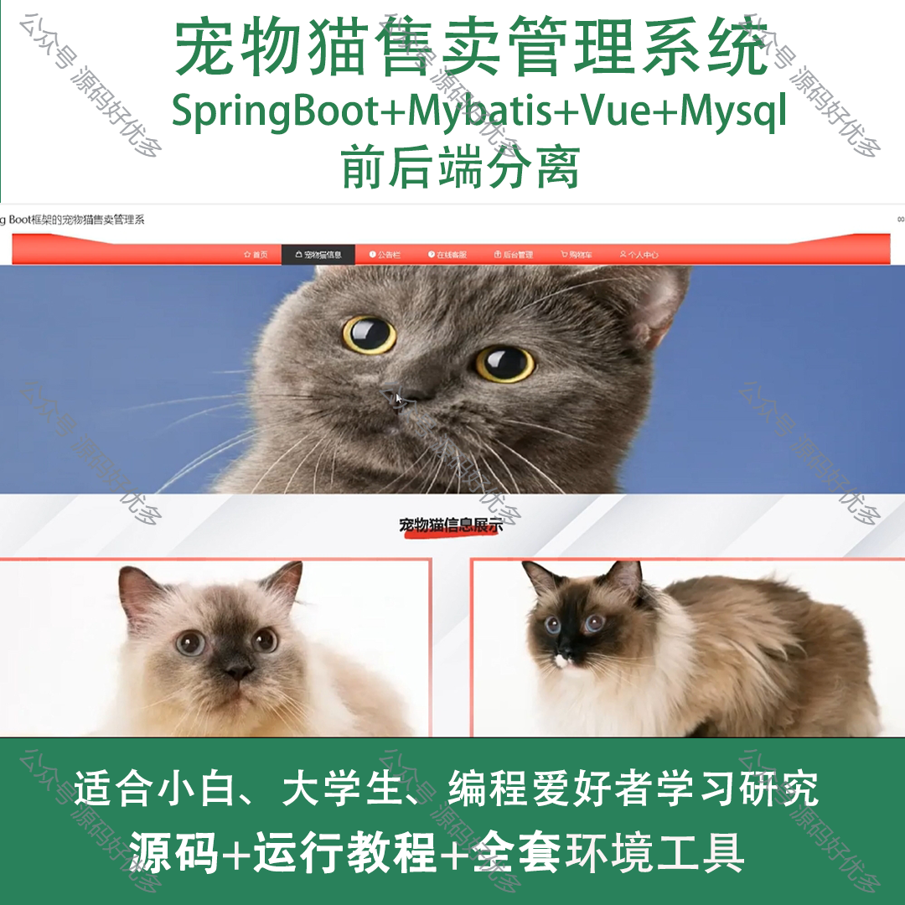
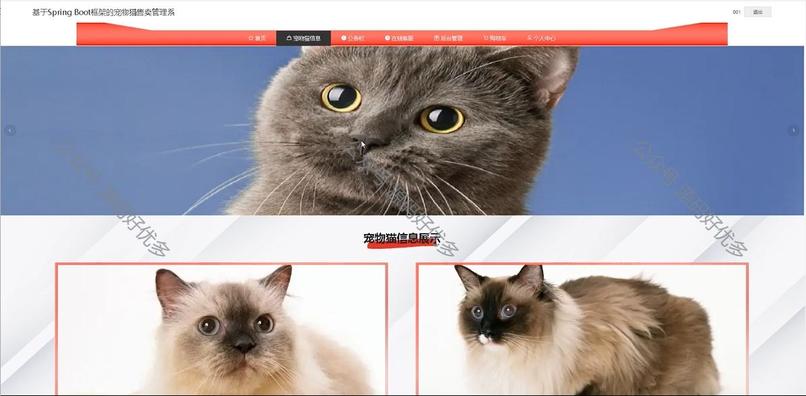
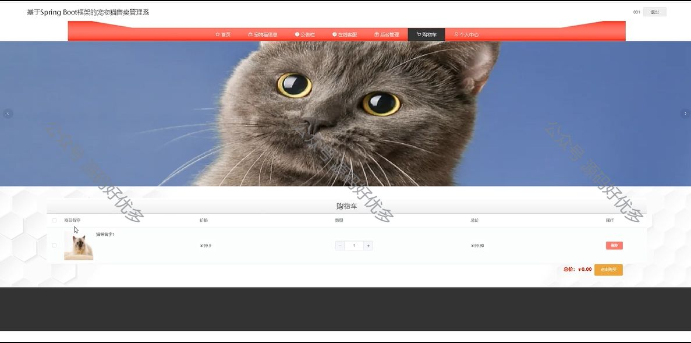
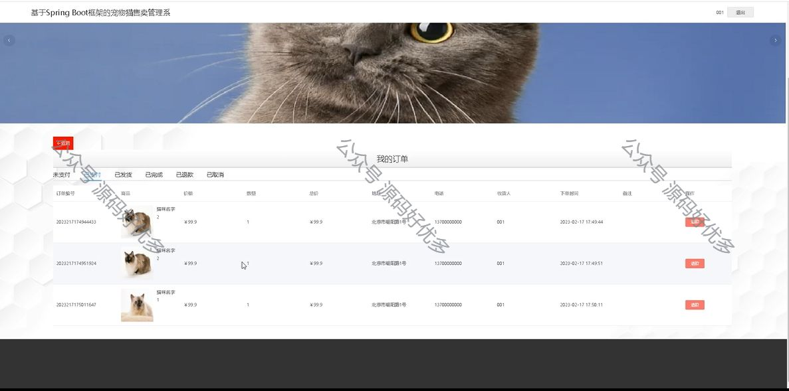
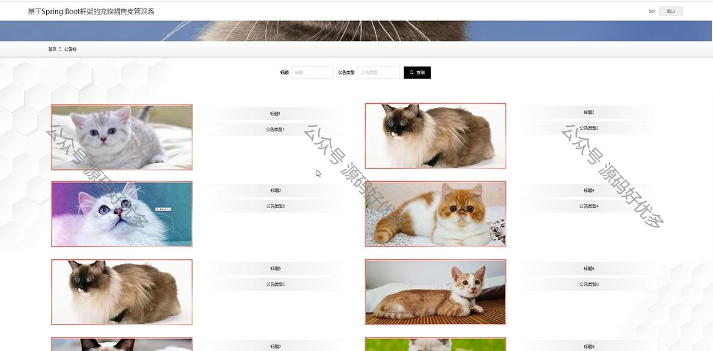
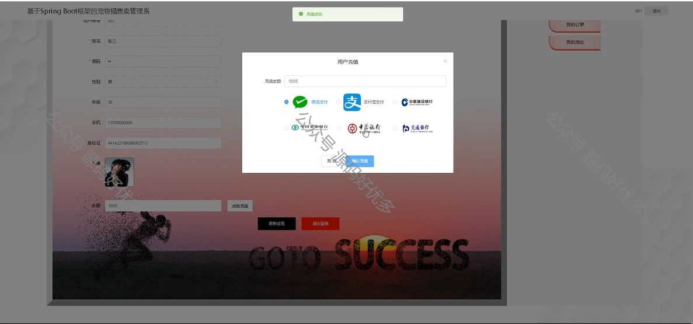
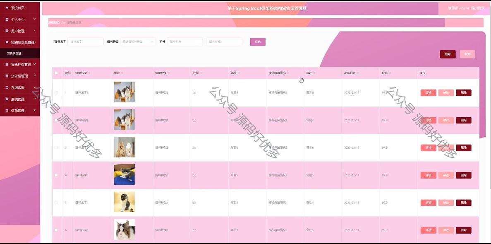
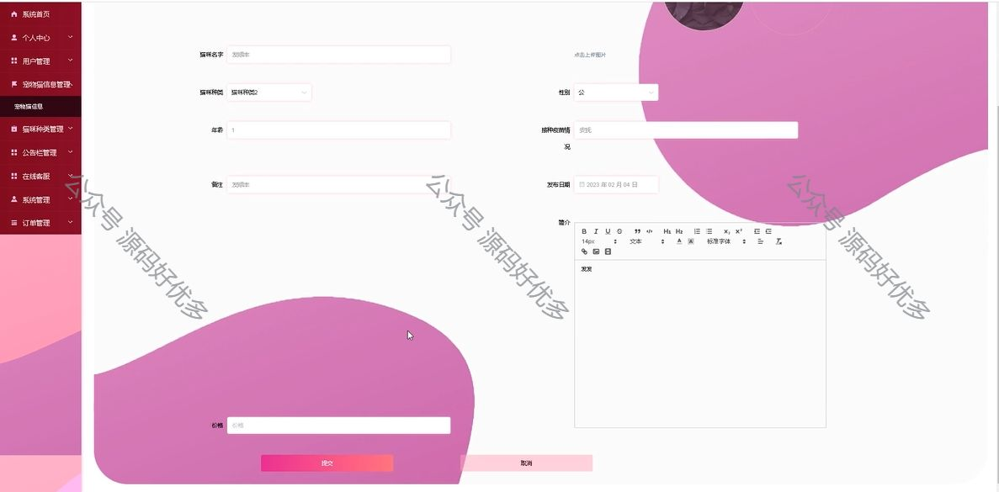

 
## 查看主页获取源码

> **作者介绍**： **✌**全网粉丝10W+本平台特邀作者、博客专家、CSDN新星计划导师、java领域优质创作者,博客之星、掘金/华为云/阿里云/InfoQ等平台优质作者、专注于项目实战 **✌**

  

### 一、作品包含

源码+数据库+全套环境和工具资源+部署教程

### 二、项目技术

前端技术：Html、Css、Js、Vue、Element-ui

数据库：MySQL

后端技术：Java、Spring Boot、MyBatis

  

### 三、运行环境

开发工具：IDEA/eclipse

数据库：MySQL5.7

数据库管理工具：Navicat10以上版本

环境配置软件： JDK1.8+Maven3.6.3

前端Nodejs：14

### 四、项目介绍
项目编号：springbootA105

宠物猫售卖管理系统是在宠物市场日益繁荣，特别是宠物猫爱好者群体不断扩大的背景下应运而生的一套专业管理工具。该系统通过整合宠物猫的品种信息，旨在为宠物猫销售商提供一个便捷、高效的管理平台，同时为消费者提供透明、优质的购物体验，推动宠物猫销售行业的规范化和信息化发展。

前台用户功能：登录注册、浏览首页、宠物猫信息、公告栏、在线客服、后台管理、购物车和个人中心、我的订单、等。

后台管理员的功能：系统首页、个人中心、用户管理、宠物猫信息管理、猫咪种类管理、公告栏管理、在线客服、系统管理、订单管理、等。

### 五、运行截图

  
